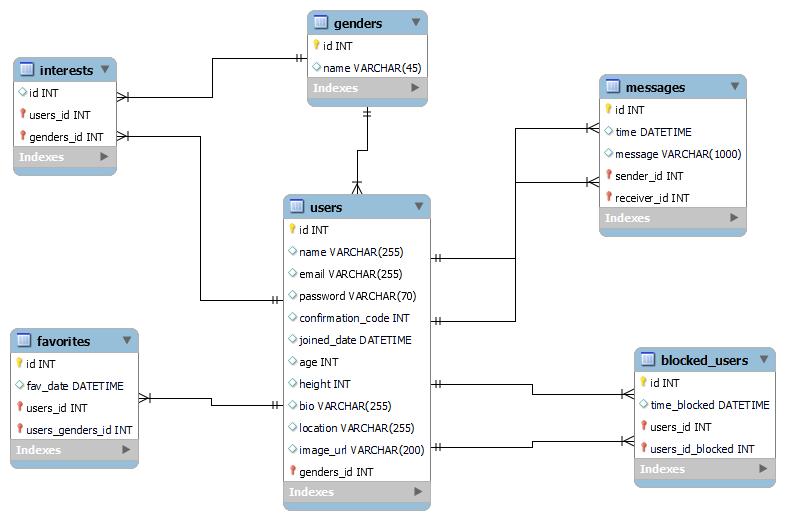

<h1>Dating.com</h1>

This is my dating website project using Vanilla HTML, CSS, JS, and Laravel.
On Signup, users choose their gender and which gender they are interested in. They also specify their location.
Users can only surf people who are interested in.
After logging in, users are displayed and sorted by their location.
Users are able to upload a picture, bio, age..
Users are be able to favorite others. Favorite users are displayed in a seperate page.
Users are be able to block others. Blocked users should not appear anywhere
Users are be able to chat with one another

<h3>ER Diagram</h3>

